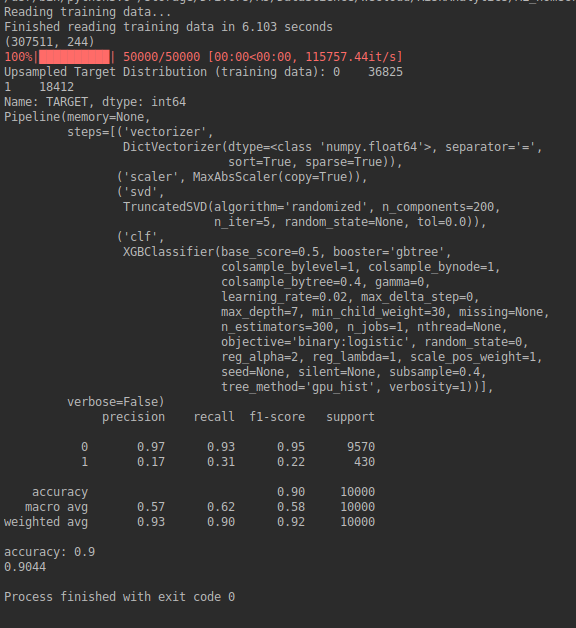

# homecredit_XGBoost
Homecredit Machine Learning (XGBoost Classifier) Project.

This is a machine learning project using the "Home Credit Default Risk" Kaggle competition. The raw data can be found here: https://www.kaggle.com/c/home-credit-default-risk

This project uses XGBoost Classifier to predict their clients' repayment abilities. The project process includes:
* Data manipulation using SQL: merging and cleaning the original eight files.
* Handling imbalanced dataset: I used the "upsampling" method to increase the ratio of the target value 1 to about 33% (1:3 ratio).
* Transformation of data: encoding categorical features using DictVectorizer, scaling numeric features using MaxAbsScaler, feature reduction using PCA.
* Pipeline was built using sklearn.pipeline.
* Hyper-parameter tuning: I used RandomizedSearchCV using "balanced_accuracy" as scoring to refit.

Since the size of the dataset is large:
* I built the "sample_size" parameter under "prepare_data" function, so that we can run the model with smaller dataset.
* I used GPU to run it faster ('clf__tree_method': ['gpu_hist'],).

Here is the result of the model using randomly selected 50,000 records (40,000 train data set, 10,000 test data set):
Accuracy is 0.90. Recall of "1" is a bit weak at 0.31; however, very strong recall of "0" at 0.93.

